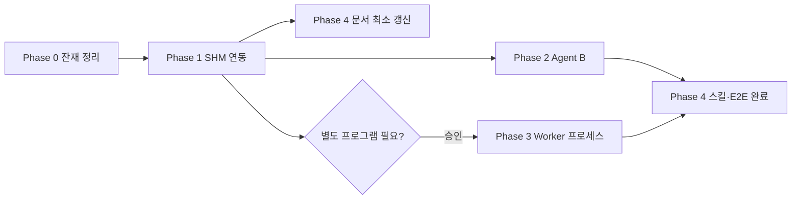

# 멀티 에이전트 SHM 오케스트레이션 정합성 복구 구현 계획

## 계획 유형

- **주 유형**: 버그 수정 (문서·UI·산출물과 실제 동작 불일치, SHM 미연동)
- **부가 유형**: 신규 기능 (Agent A Worker 프로세스 엔트리, E2E 테스트) — **Phase 3 이후 별도 승인 게이트**
- **이번 턴**: 계획 수립만 (코드 변경 없음, 사용자 승인 대기)

---

## 범위

### 사용자 요청 요약

멀티 에이전트( Main AI / Agent A / Agent B ) 구조를 아키텍처 문서대로 **공유 메모리 기반·정직한 동작**으로 복구한다. Mock UI·가짜 `output/` 산출물을 제거하고, Agent A는 당장은 스레드/동기 subprocess로 두되 **추후 별도 프로그램**으로 분리 가능한 경계를 만든다.

### 이번 작업에 포함

| Phase | 내용 | 승인 |
|-------|------|------|
| **0** | Mock 잔재 정리, UI 거짓 문구 제거 | Phase 0 단독 승인 가능 |
| **1** | SHM 버스 프로토콜 SSOT + 오케스트레이터·UI 연동 | **필수 1차** |
| **2** | Agent B 실검증 (코딩: ruff, 리서치: 검사 가능 규칙) | Phase 1 검증 후 |
| **3** | Agent A Worker 독립 프로세스 엔트리 | Phase 1·2 후 별도 승인 |
| **4** | E2E 테스트, 아키텍처 문서 동기화 | Phase 1과 병행 가능 |

### 제외 (승인 전 구현 안 함)

- mystock_web 실시간 시세 API 연동 (리서치 “진짜 시장 데이터”는 별도 프로젝트 범위)
- pywebview UI 디자인 전면 개편
- Graphify/문서 대량 리팩터 (필요 최소만)
- Git commit/push (사용자 명시 요청 시만)

---

## 불량(버그) — 현상·원인·최소 수정

### 현상

1. UI·`output/`·로그가 **3자 SHM 핑퐁·팩트 승인**처럼 보이나, 실제는 **단일 프로세스 + Cursor subprocess + Python if 2줄**.
2. `shm_realtime_poller`는 `AgentA`/`AgentB` 메시지를 기다리나, **프로덕션 코드는 `write_message`를 호출하지 않음** (테스트만 사용).
3. `output/삼성전자_종합투자분석보고서_20260517.md` 등은 **13:08 Mock 세션 잔재** (허구 시세).
4. 최종 보고 문구 `"IPC 버스를 통해 핑퐁"` 등 **사실과 다른 마케팅 문구**.

### 원인

- Mock 제거(13:18) 시 **오케스트레이터 ↔ SHM 배선**이 누락됨.
- Agent B가 별도 에이전트/검증기가 아니라 `shm_orchestrator.py` 내 휴리스틱.
- 아키텍처 문서·스킬 설명이 **목표 상태**와 **구현 상태**를 혼동.

### 최소 수정 (Phase 0 + 1, 신규 “기능” 없이 버그 클로즈)

- 오케스트레이션 **각 단계마다** `SharedMemoryIPCDriver.write_message`로 `MainAI` / `AgentA` / `AgentB` 이벤트 게시 → UI 폴러가 **실제 버스 트래픽**만 렌더.
- 거짓 최종 문구 삭제 → **실제 수행 경로**만 기술 (예: “Cursor SDK 응답을 저장함”, SHM 미사용 시 명시).
- Mock 산출물·로그 **아카이브 또는 삭제** (혼동 방지).

**최소안 불가/불충분 시에만 (Phase 3, 승인 후)**  
Agent A를 별도 OS 프로세스로 분리 — Phase 1만으로는 “별도 프로그램” 요구의 **물리적 분리**는 미충족. Phase 1은 **동일 프로토콜·동일 SHM**으로 경계만 고정.

---

## 제거·대체 대상 (Deprecation & Cleanup List)

| 제거·축소 | 대체 |
|-----------|------|
| 오케스트 중 **Main만 `evaluate_js`로 A/B 연출**하는 패턴 | SHM `write_message` → 기존 `shm_realtime_poller` |
| `final_report` 내 **“100% 무결 IPC 핑퐁”** 등 검증되지 않은 문구 | 사실 기반 상태 문자열 (성공/실패, 시도 횟수, 저장 경로) |
| `output/`·`log/` 내 **Mock 세션 파일** (사용자 확인 후) | `docs/archive/mock_sessions_260517/` 이동 또는 삭제 |
| (Phase 2) Agent B **길이·TODO만** 검사하는 단독 로직 | `utils/shm_reviewer.py` 단일 모듈 (ruff + 구조화 규칙) |
| (Phase 3) 오케스트레이터 내 **직접 `execute_modify_task` 동기 호출** (inline 모드 유지 시에도) | Worker 프로세스가 SHM `TASK_EXECUTE` 수신 후 실행 |

**유지**

- `utils/shm_ipc_driver.py` — IPC SSOT (변경 최소)
- `main/node_bridges/shm_cursor_sdk_driver.mjs` — Cursor SDK 브릿지
- API Key 결손 시 **기동 차단** (정직 가드)

---

## 계획 (Karpathy-Style)

### Think Before Coding

| 가정 | 내용 |
|------|------|
| A1 | UI는 `sipc_demo_session` 단일 SHM, sender_id는 `MainAI`/`AgentA`/`AgentB` (폴러와 일치) |
| A2 | 페이로드는 기존 슬롯 한도 **3976 bytes** — 장문은 `output/` 파일 경로만 SHM에 실음 |
| A3 | Agent A “별도 프로그램”은 **동일 `write_message`/`read_next_message` 프로토콜**로 attach |
| A4 | 리서치 **실시장 시세**는 본 계획 범위 밖 — “가짜 숫자 금지”는 **출처 없는 수치 생성 금지 + API/키 없으면 실패 공표**로 닫음 |

**기존 패턴 검색 (`rg`) — PASS**

- `write_message` / `read_next_message`: `utils/shm_ipc_driver.py`, `tests/test_shm_ipc_260517.py` (다중 프로세스 패턴 존재)
- `sender_id` `Agent_A` vs `AgentA`: UI 폴러는 `AgentA` — **프로토콜 상수로 통일 필수**
- Mock 문자열 `78,200`, `삼성전자 1차`: 현재 `main/` 소스에 **없음** (잔재는 `output/`·`log/`만)

### Simplicity First

- **새 래퍼 계층 금지** — `utils/shm_agent_bus.py`는 `write_message` 호출·command 상수·payload 스키마만 (포워딩 1줄짜리 클래스 금지).
- Phase 1: Agent A는 **기존 `SharedMemoryCursorAgentDriver`를 오케스트레이터 프로세스에서 호출**하되, **모든 단계 이벤트는 SHM에 기록**.
- Phase 3: 동일 드라이버 호출을 **`main/agent_a_worker.py`로 이동**만 (로직 복제 금지).

### 성공 기준 (Verifiable Goals)

| ID | 기준 | 검증 방법 |
|----|------|-----------|
| G1 | 사용자 메시지 1회 처리 시 SHM에 `AgentA`·`AgentB` 각 ≥1건 기록 | `tests/shm_orchestration_e2e_260517/` 또는 로그에 msg_id |
| G2 | UI 폴러만으로 A/B 버블 표시 가능 (`evaluate_js`로 A/B 본문 주입 **금지**) | 코드 리뷰 + E2E |
| G3 | API Key 없으면 Mock 대신 **차단 메시지** (기존 유지) | 수동 1회 |
| G4 | `output/` 저장 본문에 **고정 템플릿 시세(78,200 등)** 없음 | grep + E2E |
| G5 | 최종 Main 메시지에 **“IPC 핑퐁 완료”** 등 미검증 문구 없음 | grep `app_webview.py` |
| G6 | `ruff check .` 및 기존 IPC 유닛 테스트 8건 통과 | CI/로컬 |
| G7 (Phase 3) | `python -m main.agent_a_worker --shm sipc_demo_session` 단독 기동 시 TASK 처리 | 프로세스 E2E |

### UI ↔ 엔진 단일 경로 (AGENTS.md §4 대응)

- **챗 버블 SSOT**: `SharedMemoryIPCDriver` 링 버퍼 (`read_next_message` → `shm_realtime_poller` → `addMessage`).
- **작업 결과 SSOT**: `orchestrator.run_orchestration_loop` 반환값 → `output/` 파일 (경로는 SHM `ORCH_ARTIFACT` 이벤트로 UI에 전달).
- **금지**: `time.sleep` + 하드코딩 텍스트로 A/B 대화 연출.

### UX·과도기 상태

- API Key 로딩 중: Main에 **“키 확인 중”** 1회 (SHM 또는 직접, 단 A/B 연출 없음).
- 오케스트레이션 **진행 중**: Agent A에 `WORKER_PROGRESS` (선택, 짧은 텍스트).
- 실패: `success: false` + `error`를 SHM `ORCH_FAILED` + Main 버블 (원인·탐색 경로 포함, 기존 키 가드와 동일 톤).

### 호환성·상수화

- `utils/shm_protocol.py` (신규): `SENDER_MAIN`, `SENDER_AGENT_A`, `SENDER_AGENT_B`, `CMD_*`, `SHM_DEMO_NAME` (현재 `app_webview` 하드코딩 이관).
- 워크스페이스: `MYSTOCK_WORKSPACE` 환경변수, 기본값 `c:\Work\mystock_web`.

---

## Graphify Context

- **GRAPH_REPORT 확인**: 2026-05-17 (선행 Read 완료). 구현 후 `graphify update .` 예정.
- **참고 허브·커뮤니티**:
  - God Node: `SharedMemoryIPCDriver` (Community 1·2·3 — IPC 코어)
  - God Node: `SharedMemoryMultiAgentOrchestrator` (Community 6)
  - God Node: `WebViewApi` (Community 5 — UI·폴러)
- **파일 선정 근거**: Graphify가 `WebViewApi` → `SharedMemoryIPCDriver` / `SharedMemoryMultiAgentOrchestrator` **uses** 엣지를 이미 표시 — 배선 누락은 이 세 모듈 간 연결이 목표.

---

## Phase별 상세

### Phase 0 — Mock 잔재·거짓 문구 (0.5일)

**변경**

| 파일 | 작업 |
|------|------|
| `output/삼성전자_종합투자분석보고서_20260517.md` | `docs/archive/mock_sessions_260517/`로 이동 (또는 삭제 — **사용자 선택**) |
| `log/20260517_130853.log` | 동일 아카이브 |
| [MODIFY] `main/app_webview.py` | `final_report` 문구를 사실 기반으로 축소 |
| [ADD] `docs/archive/mock_sessions_260517/README.md` | “Mock 세션 산출물, 시세 무효” 3줄 안내 |

**검증**: G4, G5

---

### Phase 1 — SHM 버스 SSOT + 오케스트레이터 연동 (1~2일) ★ 필수

#### 1.1 프로토콜 (`utils/shm_protocol.py`)

```text
sender_id: MainAI | AgentA | AgentB
commands (예시):
  ORCH_INTENT      — DTO 요약 (intent, targetFile)
  WORKER_START     — 작업 시작
  WORKER_RESULT    — 본문 일부 또는 요약 (max ~3KB)
  REVIEW_REJECT    — reject_reason, attempt
  REVIEW_APPROVE   — attempt
  ORCH_COMPLETE    — output_path, success
  ORCH_FAILED      — error
payload 공통: { "text": str, "attempt"?: int, "meta"?: dict }
```

#### 1.2 버스 헬퍼 (`utils/shm_agent_bus.py`)

- `ShmAgentBus(shm_name, create=False)` — 내부 `SharedMemoryIPCDriver` 1인스턴스
- `publish(sender, command, text, **meta)` — JSON 크기 가드, 초과 시 `text` 잘라내고 `meta.truncated=true`
- **중복 구현 금지**: 인덱스·락 로직은 `shm_ipc_driver`에만 존재

#### 1.3 오케스트레이터 (`utils/shm_orchestrator.py`)

- `run_orchestration_loop(..., bus: ShmAgentBus | None)` — `bus` 주입 시 각 단계 publish
- 흐름:
  1. `parse_intent` → `ORCH_INTENT` (MainAI)
  2. Agent A 호출 전후 → `WORKER_START` / `WORKER_RESULT` (AgentA)
  3. Agent B 판정 → `REVIEW_REJECT` | `REVIEW_APPROVE` (AgentB)
  4. 종료 → `ORCH_COMPLETE` | `ORCH_FAILED` (MainAI)
- **Agent A 실행**: Phase 1에서는 기존 `SharedMemoryCursorAgentDriver.execute_modify_task` 유지

#### 1.4 웹뷰 (`main/app_webview.py`)

- `SharedMemoryMultiAgentOrchestrator(..., shm_name=SHM_DEMO_NAME)` 또는 `ShmAgentBus` 생성 후 루프에 전달
- `_run_orchestrator_background`: **A/B 본문을 `evaluate_js`로 넣지 않음** (폴러 전담)
- Main 직접 출력: 사용자 입력 에코, API Key 오류, `ORCH_COMPLETE` 요약만 허용
- 웰컴 시퀀스: 선택 A) SHM으로만 3자 웰컴 / 선택 B) 웰컴은 직접 JS 유지하되 **“시스템 안내”**로 라벨 (아키텍처 문서에 명시)

**권장**: 웰컴도 SHM `GREETING`으로 통일 (G2 완전 충족).

#### 1.5 테스트

| 경로 | 내용 |
|------|------|
| [ADD] `tests/shm_orchestration_e2e_260517/test_shm_bus_publish.py` | bus만으로 write→read, sender/command 검증 |
| [ADD] `tests/shm_orchestration_e2e_260517/test_orchestrator_shm_events.py` | `execute_modify_task` mock + bus 캡처 → G1 |

기존 `tests/test_shm_orchestrator.py` — mock 유지, bus publish assertion 추가.

**검증**: G1, G2, G5, G6, `verify-cursor-agent` 스킬 체크리스트

---

### Phase 2 — Agent B 실검증 (1일)

#### 2.1 `utils/shm_reviewer.py` (신규, SSOT)

| 모드 | 검증 |
|------|------|
| `CODE_MODIFY` (`bypassRules=false`) | `ruff check <workspace>` (subprocess), TODO/FIXME 본문 검사 |
| `MARKET_RESEARCH` | 본문 길이 하한 + **“출처/조사불가” 명시 필수** (키 없으면 Cursor 응답에 “데이터 소스 없음” 포함 요구) |
| 공통 | 빈 출력 → REJECT |

- 오케스트레이터의 if 블록 **삭제** → `ShmReviewer.review(dto, text) -> (approved, reason)` 호출만

#### 2.2 리서치 정직성 (버그 클로즈)

- Cursor 프롬프트에: **실시장 API 없으면 임의 가격·수치 생성 금지**, 불가 시 `DATA_UNAVAILABLE` 섹션만 출력.
- `output/` 저장 전: `78,200` 같은 패턴 **회귀 테스트 금지 문자열** 목록 (테스트 fixture).

**검증**: G4, ruff 실패 시 REJECT 1회 이상 E2E

---

### Phase 3 — Agent A Worker 프로세스 (1~2일, 별도 승인)

#### 3.1 `main/agent_a_worker.py`

```text
python -m main.agent_a_worker --shm sipc_demo_session [--workspace PATH]
```

- 루프: `read_next_message("AgentA")` → `command == TASK_EXECUTE` → `SharedMemoryCursorAgentDriver` → `WORKER_RESULT` publish
- 종료: SIGINT / `WORKER_SHUTDOWN` command

#### 3.2 오케스트레이터 실행 모드

- `AGENT_A_MODE=inline|process` (환경변수)
- `process`: `subprocess.Popen` worker, SHM으로 TASK만 전달, 결과는 SHM에서 수신 대기 (타임아웃 명시)

**검증**: G7, 기존 IPC 다중 프로세스 테스트와 동일 패턴

---

### Phase 4 — 문서·스킬 동기화 (0.5일)

| 파일 | 작업 |
|------|------|
| [MODIFY] `docs/architecture/rule_aware_agent_architecture_260517.md` | “현재 구현 상태” vs “목표” 절 추가, Phase 3 전/후 다이어그램 |
| [MODIFY] `.agent/skills/verify-cursor-agent/reference.md` | G1~G2 E2E 항목 |
| [MODIFY] `docs/debugging_notes.md` | 구현 완료 시 역순 1건 |

---

## 변경 파일 요약

| Phase | ADD | MODIFY |
|-------|-----|--------|
| 0 | `docs/archive/mock_sessions_260517/README.md` | `main/app_webview.py`, 아카이브 이동 |
| 1 | `utils/shm_protocol.py`, `utils/shm_agent_bus.py`, `tests/shm_orchestration_e2e_260517/*` | `utils/shm_orchestrator.py`, `main/app_webview.py`, `tests/test_shm_orchestrator.py` |
| 2 | `utils/shm_reviewer.py` | `utils/shm_orchestrator.py`, `main/node_bridges/...` 프롬프트 보강(최소) |
| 3 | `main/agent_a_worker.py`, `tests/shm_orchestration_e2e_260517/test_agent_a_worker.py` | `utils/shm_orchestrator.py` |
| 4 | — | `docs/architecture/rule_aware_agent_architecture_260517.md`, verify 스킬 |

---

## 검증 계획

```powershell
# 매 Phase 후
ruff check .
python -m unittest tests/test_shm_ipc_260517.py tests/test_shm_broadcast.py tests/test_shm_orchestrator.py -v
python -m unittest tests/shm_orchestration_e2e_260517/ -v

# Phase 2+
ruff check <workspace>  # reviewer 통합 확인

# 구현 후
graphify update .
```

| 스킬 | 시점 |
|------|------|
| `code-writing-guard` | 구현 전·후 |
| `verify-cursor-agent` | Phase 1·2 완료 후 |
| `lint-fix-standard` | ruff 0 warnings |

---

## 구현 순서·승인 게이트



1. **사용자 승인**: 본 계획서 + Phase 0~1 범위  
2. 구현 Phase 0 → 1 → 테스트 → `debugging_notes.md`  
3. **사용자 승인**: Phase 2 진행 여부  
4. **사용자 승인**: Phase 3 (별도 프로세스) 진행 여부  

---

## 리스크·트레이드오프

| 리스크 | 완화 |
|--------|------|
| SHM 페이로드 4KB 초과 | 본문은 `output/`만, SHM에는 요약+경로 |
| 폴러·writer 레이스 | 기존 파일 락 유지; 폴러는 `last_read_id` 점프 패턴 유지 |
| Cursor SDK 지연 | UI에 `WORKER_PROGRESS`; 타임아웃 시 `ORCH_FAILED` |
| Phase 3 프로세스 좀비 | `atexit` / webview `on_closed`에서 worker 종료 신호 |

---

## 개선·리팩터 제안 (수정 검증 후, 선택)

- `default_workspace`를 UI 설정 파일로 외부화
- 리서치용 **실제 시세 API** 어댑터 (mystock_web 연동) — **별도 신규 기능 계획**
- Agent B를 **별도 프로세스**로 분리 (Phase 3과 동형)

---

## 다음 액션 (사용자)

1. **Phase 0~1 진행 승인** 여부  
2. Mock 파일 **삭제 vs `docs/archive/` 이동** 선택  
3. 웰컴 메시지 **SHM 통일 vs UI 직접(시스템 안내)** 선택  
4. Phase 3(별도 Worker exe) **이번 스프린트 포함 여부**

승인해 주시면 Phase 0부터 순서대로 구현합니다.
