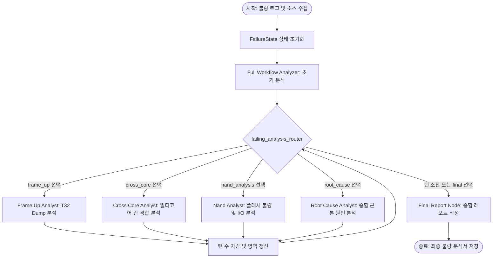

# 🛠️ Firmware Failure Analysis Agent Design (FW 불량 분석 에이전트 설계서)

본 문서는 T32 덤프, UART 로그, 펌웨어 소스 코드 등의 데이터를 융합 분석하여 불량의 근본 원인(Root Cause)을 도출하기 위해, LangGraph 프레임워크 기반의 동적 라우팅 및 피드백 루프 아키텍처를 도입하는 설계 명세서입니다.

---

## 1. 개요 (Overview)
기존의 하드코딩된 단방향(Linear) 분석 프로세스의 한계를 극복하고, **LLM이 분석 결과를 평가하여 다음에 검증할 영역(T32 Dump, Cross-Core, NAND 등)을 동적으로 선택**하여 추적하는 순환 피드백 루프 에이전트 시스템을 구축합니다.
이를 통해 복잡한 임베디드 예외(Exception), 하드웨어 오작동, 소프트웨어 데드락이 얽힌 문제를 다각도에서 교차 검증할 수 있습니다.

---

## 2. 경계 (Boundaries)

### 입력 데이터 경계
- **T32 Dump / Register Context**: 코어 별 CPU 레지스터, 콜스택, 메모리 덤프 데이터.
- **Console/UART Log**: 시스템 부팅 및 크래시 발생 직전의 실시간 로깅 및 커널 메시지.
- **Source Code**: 예외가 발생한 주소 주변의 C/C++ 펌웨어 소스 코드 영역.

### 분석 도구 경계
- **Cursor CLI API**: 펌웨어 소스 코드의 컴파일 에러 및 의미론적 버그를 분석하는 API.
- **인메모리 FailureState**: 분석가 간 정보 교환 및 제어에 사용되는 유일한 공유 상태 데이터.

### 출력 경계
- **Final Failure Analysis Report**: 근본 원인(Root Cause) 요약, 실현 가능한 불량 재현 경로(Reproduction Path), 펌웨어/하드웨어 패치 조치 방안(Action Plan).

---

## 3. 데이터 흐름 (Data Flow)

시스템은 최초의 거시 분석 이후, LLM이 결정한 우선순위에 따라 각기 다른 전문 분석 노드들로 조건부 라우팅을 수행하며 상태를 갱신합니다.



### 상태 전이 프로세스
1. **분석가 실행**: 분기된 노드(예: `Frame Up Analyst`)에서 Cursor API 등을 통해 추가 심층 분석을 집행합니다.
2. **LLM 추론 및 다음 단계 결정**: LLM이 분석 결과를 평가하여 `"next_analysis_area"` 필드에 다음 수행할 분석 카테고리를 기입하고, `"rounds_left"`를 1 차감합니다.
3. **조건부 라우팅**: 노드 반환 시 `failing_analysis_router`가 해당 정보를 읽어 즉시 다음 목적지 노드로 제어를 넘깁니다.
4. **최종 판정**: `rounds_left <= 0`이 되거나 결정이 완결되면 `Final Report Node`로 이탈합니다.

---

## 4. 관련 코드 경로 (Related Code Paths)

### A. 공유 상태 명세 (`FailureState`)
`tradingagents/agents/utils/agent_states.py` 패턴을 차용한 데이터 모델입니다.

```python
from typing import Annotated, TypedDict

class FailureState(TypedDict):
    # 기초 불량 컨텍스트
    failure_log: str
    t32_dump_path: str
    source_code_context: str
    
    # 턴 제어 및 동적 라우팅 변수
    next_analysis_area: str  # "frame_up", "cross_core", "nand_analysis", "root_cause", "final", "end"
    rounds_left: int        # 남은 분석 라운드 수 (5에서 1씩 차감)
    
    # 누적 기록 및 리포트
    analysis_history: list[dict] # 턴별 분석가의 판단 누적
    current_hypothesis: str     # 현재 턴에서 갱신된 불량 가설
```

### B. 조건부 에지 라우터 (`failing_analysis_router`)
`tradingagents/graph/conditional_logic.py` 방식을 바탕으로 구현된 라우터 함수입니다.

```python
def failing_analysis_router(state: FailureState) -> str:
    """에이전트 판단 결과를 해석하여 다음 분석 노드로 동적 분기합니다."""
    
    # 턴 소진 또는 강제 종료 시 최종 보고서 작성 단계로 전환
    if state["rounds_left"] <= 0 or state["next_analysis_area"] in ["final", "end"]:
        return "Final Report Node"
        
    # 지정 영역에 따라 분기
    area = state["next_analysis_area"]
    if area == "frame_up":
        return "Frame Up Analyst"
    elif area == "cross_core":
        return "Cross Core Analyst"
    elif area == "nand_analysis":
        return "Nand Analyst"
    elif area == "root_cause":
        return "Root Cause Analyst"
    else:
        return "Final Report Node"
```

### C. LangGraph 구성 명세
`tradingagents/graph/setup.py` 방식을 대입한 워크플로우 빌드 스크립트 구조입니다.

```python
from langgraph.graph import StateGraph, START, END

workflow = StateGraph(FailureState)

# 각 분석 영역 노드 추가
workflow.add_node("Full Workflow Analyzer", full_workflow_node)
workflow.add_node("Frame Up Analyst", frame_up_node)
workflow.add_node("Cross Core Analyst", cross_core_node)
workflow.add_node("Nand Analyst", nand_node)
workflow.add_node("Root Cause Analyst", root_cause_node)
workflow.add_node("Final Report Node", final_report_node)

# 그래프 연결 설정
workflow.add_edge(START, "Full Workflow Analyzer")

# 각 분석 노드가 완료된 후 조건부 라우터를 타도록 매핑
analyst_nodes = [
    "Full Workflow Analyzer",
    "Frame Up Analyst",
    "Cross Core Analyst",
    "Nand Analyst",
    "Root Cause Analyst"
]

for node in analyst_nodes:
    workflow.add_conditional_edges(
        node,
        failing_analysis_router,
        {
            "Frame Up Analyst": "Frame Up Analyst",
            "Cross Core Analyst": "Cross Core Analyst",
            "Nand Analyst": "Nand Analyst",
            "Root Cause Analyst": "Root Cause Analyst",
            "Final Report Node": "Final Report Node"
        }
    )

workflow.add_edge("Final Report Node", END)
app = workflow.compile()
```

---

## 5. 라이선스 및 보안 가이드라인 (Security & License Guidelines)

사내 솔루션 개발 및 엄격한 보안 감사(Security Audit) 통과를 위해, 본 설계 구조를 실현할 때는 아래 지침을 의무적으로 준수해야 합니다.

### 🔴 라이선스 가이드라인 (Clean-room Rewrite)
- **외부 종목 분석 코드 의존성 제거**: `yfinance`, `ccxt`, `stockstats` 등 금융 수집 라이브러리는 Copyleft 라이선스 감염 리스크 및 비핵심 종속성이므로 사내 레포지토리 배포본에서 **반드시 완전히 삭제**합니다.
- **개념적 재작성 권장**: LangGraph 프레임워크 자체(MIT License)는 합법적으로 임포트해 사용하되, `tradingagents` 소스 코드는 아키텍처적 설계 사상(State Dict 공유 및 Router를 통한 동적 순환 기법)만 참조 및 벤치마킹하고, **펌웨어 분석 로직 및 노드는 사내에서 제로베이스(Scratch)로 독자 구현(In-house 개발)**할 것을 강력히 권장합니다.

### 🔒 데이터 및 소스 보안 가이드라인 (On-Premise LLM)
- **사내망 폐쇄형 AI 서빙**: T32 레지스터 덤프 데이터, UART 크래시 로그, 소스 코드 조각은 최고 등급의 영업비밀에 해당합니다. 클라우드 LLM API(OpenAI, Anthropic 등) 호출을 엄격히 금지하며, 사내 GPU 인프라에 **Local LLM(예: Qwen-2.5-Coder-32B, Llama-3-70B 등)**을 프라이빗 서빙(via Ollama, vLLM)하여 온프레미스 API 엔드포인트만 연결해 사용해야 합니다.
- **로컬 정적 분석 연동**: 소스 코드 디버깅 및 분석 시, 외부 원격 서버 연동 정적 분석 툴 대신 사내 폐쇄망에 구축된 로컬 소나큐브(SonarQube) 또는 Clang-Tidy 등의 CLI 분석 결과를 에이전트가 로컬 파일 파싱 방식으로 읽어와 컨텍스트로 취급하도록 설계합니다.

